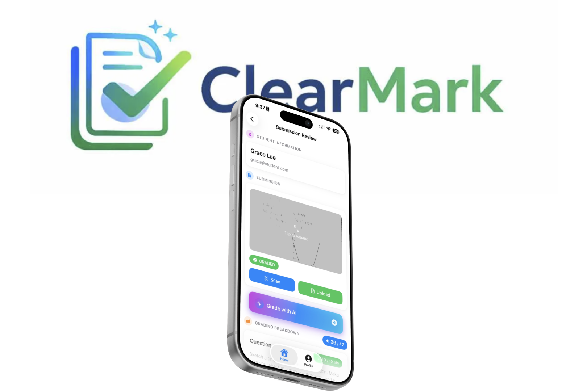

# ClearMark

<p align="center">
  
</p>

An AI-powered grading assistant iOS application designed for educators to efficiently manage courses, assignments, and student submissions with automated grading capabilities.

## Overview

ClearMark streamlines the entire assessment workflow for educators - from course management and assignment creation to submission collection via document scanning and AI-assisted grading. The app is built for instructors who want to reduce time spent on manual grading while maintaining quality feedback for students.

## Features

### Authentication
- Google Sign-In integration
- Automatic account creation for new users
- Support for Teacher and Student account types

### Course Management
- Create and manage courses with custom details
- Color-coded course cards with enrollment counts
- Add/remove students and manage enrollment roles (Owner, Admin, Student)
- Course deletion with confirmation

### Assignment System
- Create assignments with titles and due dates
- Two submission types:
  - **Admin Scan**: Instructor collects and scans student work
  - **Student Scan**: Students scan and upload their own submissions
- Track submission status and counts

### Document Scanning
- Built-in document scanner using VisionKit
- Multi-page scanning support
- Automatic image processing (B&W filter for handwritten text)
- PDF conversion from scanned images

### Grading
- **AI-Powered Grading**: Automated grading via backend API
- **Manual Grading**: Question-by-question grading with partial credit
- Customizable grading guidelines per assignment
- Feedback support for each question
- CSV export for grade analysis

### Question Management
- Add questions with solution keys
- Configure maximum points per question
- Edit grading guidelines and rubrics

## Tech Stack

| Component | Technology |
|-----------|------------|
| Framework | SwiftUI |
| Architecture | MVVM |
| Authentication | Google Sign-In SDK |
| Document Scanning | VisionKit |
| PDF Handling | PDFKit |
| Networking | URLSession (async/await) |

## Requirements

- iOS 26.2+
- Xcode 15.0+
- Swift 5.9+

## Project Structure

```
ios/
├── Assets.xcassets/     # App icons, colors, and image assets
├── Managers/            # API and network layer
│   ├── CreateRequests/  # POST request models
│   ├── ReadRequests/    # GET request view models
│   ├── UpdateRequests/  # PUT/PATCH request models
│   └── DeleteRequests/  # DELETE request models
├── Models/              # Data models
├── Views/               # SwiftUI views
├── Preview Content/     # Preview data for SwiftUI previews
├── Extensions.swift     # Swift extensions
├── Info.plist           # App configuration
└── iosApp.swift         # App entry point
```

## Setup

1. **Clone the repository**
   ```bash
   git clone https://github.com/ClearMarkApp/ios.git
   cd ios
   ```

2. **Open in Xcode**
   ```bash
   open ios.xcodeproj
   ```

3. **Configure Google Sign-In**
   - The app uses Google Sign-In for authentication
   - Client ID is configured in `Info.plist`
   - Ensure URL schemes are properly set up for OAuth callback

4. **Build and Run**
   - Select your target device or simulator
   - Press `Cmd + R` to build and run

## API

The app communicates with a backend server hosted at:
```
https://clearmark-pws1.onrender.com
```

### Key Endpoints

| Endpoint | Description |
|----------|-------------|
| `POST /api/users` | Create user account |
| `GET /api/users/classes` | Get enrolled courses |
| `POST /api/courses` | Create a course |
| `GET /api/courses/{id}` | Get course details |
| `POST /api/assignments` | Create an assignment |
| `POST /api/assignments/{id}/user/{userId}/ai-grading` | Trigger AI grading |
| `POST /api/users/{userId}/assignments/{assignmentId}/upload` | Upload submission |